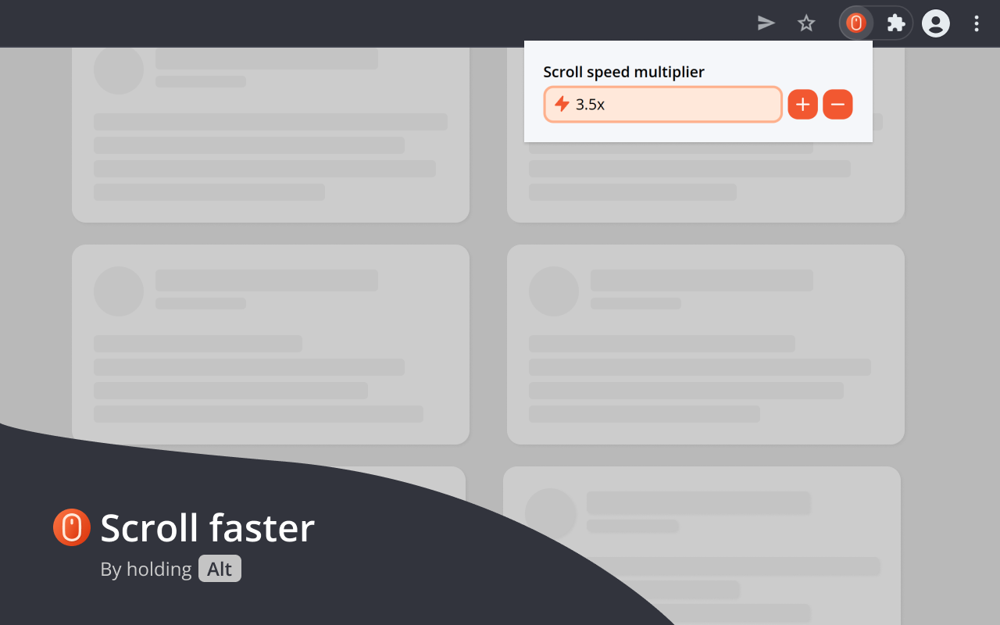

  
   
  <h1 align="center">Fast Scroll</h1>

Navigate faster by increasing your browser's scrolling speed.

  

---

## About

Fast Scroll is a simple extension to increase your Google Chrome's scrolling speed while holding the `Alt` key.

★ Easy to use

To activate the increased speed, hold the Alt key while scrolling.

★ Customization

You can change your preferred speed any time by clicking the extension icon. Your preferences are saved and synchronized to your Chrome profile.

## Installation

Fast Scroll is available at the [Chrome Web Store](https://chrome.google.com/webstore/detail/fast-scroll/dkdnncjokeklapahlhbgfnnakjjaogmb).

After installed, you'll be able to use Fast Scroll out of the box! However, make sure to reload any previously active tabs to apply the extension.

### Manual installation

For most users, installing through Chrome Web Store is recommended. However, you can follow these steps if you want a manual installation:

1. Download the latest stable release of Fast Scroll from the [Releases page](https://github.com/diego-aquino/fast-scroll/releases). The name of zipped extension file follows the example `fast-scroll-v0-3-2.zip`.
2. Extract the downloaded zip file. To ensure the extension is loaded properly, the result should be a folder containing a `manifest.json` in its root, among other necessary files and folders.
3. Install the unpacked extension on Google Chrome
   1. Open the Extension Management page by navigating to `chrome://extensions`.
   2. Enable Developer Mode by clicking the toggle switch next to Developer mode.
   3. Click the Load unpacked button and select the directory of the extracted extension you just downloaded.

  

If everything worked correctly, Fast Scroll should be ready to use! Click the extension in your toolbar, experiment with different scroll speeds and hold the `Alt` key to fast scroll!

## Issues

If you have problems, please [create an issue](https://github.com/diego-aquino/fast-scroll/issues/new). Websites are very diverse and some of them might end up disabling or affecting Fast Scroll in unexpected ways.
